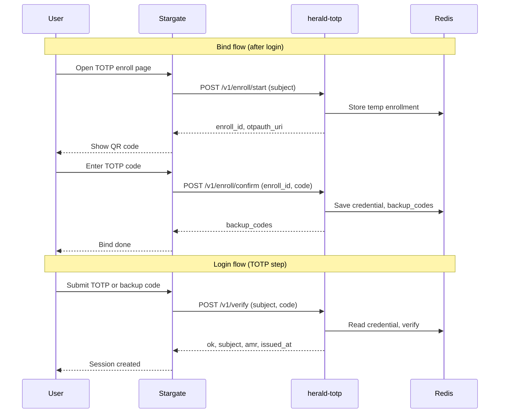

# herald-totp

[](LICENSE)
[](https://golang.org)
[](https://goreportcard.com/report/github.com/soulteary/herald-totp)

## Multi-language Documentation

- [English](README.md) | [中文](README.zhCN.md)

TOTP 2FA service for the Herald/Stargate stack: **enroll** (bind), **verify**, and optional **backup codes**. It does not send codes; users generate TOTP in an authenticator app (e.g. Google Authenticator). Stargate calls herald-totp for per-user TOTP instead of a single global secret.

## Core Features

- **Enroll**: `POST /v1/enroll/start` (returns QR content) and `POST /v1/enroll/confirm` (confirm with one TOTP code).
- **Verify**: `POST /v1/verify` (TOTP or backup code), returns `subject`, `amr`, `issued_at`; optional `challenge_id` for replay protection.
- **Revoke**: `POST /v1/revoke` to remove TOTP credential and backup codes for a subject.
- **Status**: `GET /v1/status?subject=...` to check if a user has TOTP enabled.
- **Backup codes**: 10 one-time codes returned on confirm; can be used in verify when the device is lost.
- **Security**: Encrypted secret storage (AES-GCM), rate limiting, time-step replay protection, API key or HMAC auth.
- **Graceful shutdown**: On `SIGINT` or `SIGTERM`, server stops accepting new requests and shuts down with a 10s timeout.

## Architecture

Stargate orchestrates login and TOTP bind; herald-totp stores per-user TOTP secrets (encrypted) and backup codes in Redis and performs enroll/verify.



- **Stargate**: ForwardAuth / login and TOTP bind orchestration; calls herald-totp for enroll and verify.
- **herald-totp**: Per-user TOTP secrets (AES-GCM in Redis), enroll/confirm, verify (TOTP or backup code), revoke, status.
- **Redis**: Credentials, enrollment temp state, backup codes, rate limits.

## Protocol

- **POST /v1/enroll/start** – Start enrollment; returns `enroll_id`, `otpauth_uri` (and optionally `secret_base32`).
- **POST /v1/enroll/confirm** – Submit TOTP code to confirm; returns `backup_codes`.
- **POST /v1/verify** – Verify TOTP or backup code; returns `ok`, `subject`, `amr`, `issued_at`.
- **POST /v1/revoke** – Remove TOTP and backup codes for a subject.
- **GET /v1/status?subject=...** – Check if TOTP is enabled for subject.
- **GET /healthz** – Service and Redis health (via [health-kit](https://github.com/soulteary/health-kit)).

## Configuration

| Variable | Description | Default | Required |
|----------|-------------|---------|----------|
| `PORT` | Listen port (with or without leading colon) | `:8084` | No |
| `HERALD_TOTP_ENCRYPTION_KEY` | 32-byte AES-256 key for secret encryption | `` | Yes (for enroll/verify) |
| `API_KEY` | If set, callers must send `X-API-Key` | `` | No |
| `HMAC_SECRET` / `HERALD_TOTP_HMAC_KEYS` | HMAC auth | `` | No |
| `REDIS_ADDR` | Redis address | `localhost:6379` | Yes |
| `EXPOSE_SECRET_IN_ENROLL` | If false, omit `secret_base32` in enroll/start response | `true` | No |
| `LOG_LEVEL` | Log level: trace, debug, info, warn, error | `info` | No |

See [docs/enUS/DEPLOYMENT.md](docs/enUS/DEPLOYMENT.md) for full options.

## Stargate integration

- Set `HERALD_TOTP_ENABLED=true`, `HERALD_TOTP_BASE_URL=http://herald-totp:8084`, and `HERALD_TOTP_API_KEY` or `HERALD_TOTP_HMAC_SECRET` to match herald-totp.

## Quick Start

### Build & run (binary)

```bash
go build -o herald-totp .
./herald-totp
```

With `HERALD_TOTP_ENCRYPTION_KEY` and Redis configured, enroll and verify will work.

### Run with Docker

```bash
docker build -t herald-totp .
docker run -d --name herald-totp -p 8084:8084 \
  -e HERALD_TOTP_ENCRYPTION_KEY="your-32-byte-encryption-key-here!!" \
  -e REDIS_ADDR=redis:6379 \
  herald-totp
```

Optional: add `-e API_KEY=your_shared_secret` and set `HERALD_TOTP_API_KEY` to the same value on Stargate.

## Documentation

- **[Documentation Index (English)](docs/enUS/README.md)** – [API](docs/enUS/API.md) | [Deployment](docs/enUS/DEPLOYMENT.md) | [Troubleshooting](docs/enUS/TROUBLESHOOTING.md) | [Security](docs/enUS/SECURITY.md)
- **[文档索引（中文）](docs/zhCN/README.md)** – [API](docs/zhCN/API.md) | [部署](docs/zhCN/DEPLOYMENT.md) | [故障排查](docs/zhCN/TROUBLESHOOTING.md) | [安全](docs/zhCN/SECURITY.md)

## Testing

```bash
go test ./...
```

Coverage:

```bash
go test -cover ./...
go test -coverprofile=coverage.out ./...
go tool cover -func=coverage.out
go tool cover -html=coverage.out
```

Lint: `golangci-lint run`.

## Operation

- **Graceful shutdown**: On `SIGINT` or `SIGTERM`, the server stops accepting new requests and shuts down with a 10s timeout. Logs `"shutting down"` and any shutdown error.
- **Logging**: Structured JSON logs via [logger-kit](https://github.com/soulteary/logger-kit). Set `LOG_LEVEL` to `debug` for more detail.

## License

See [LICENSE](LICENSE) for details.
