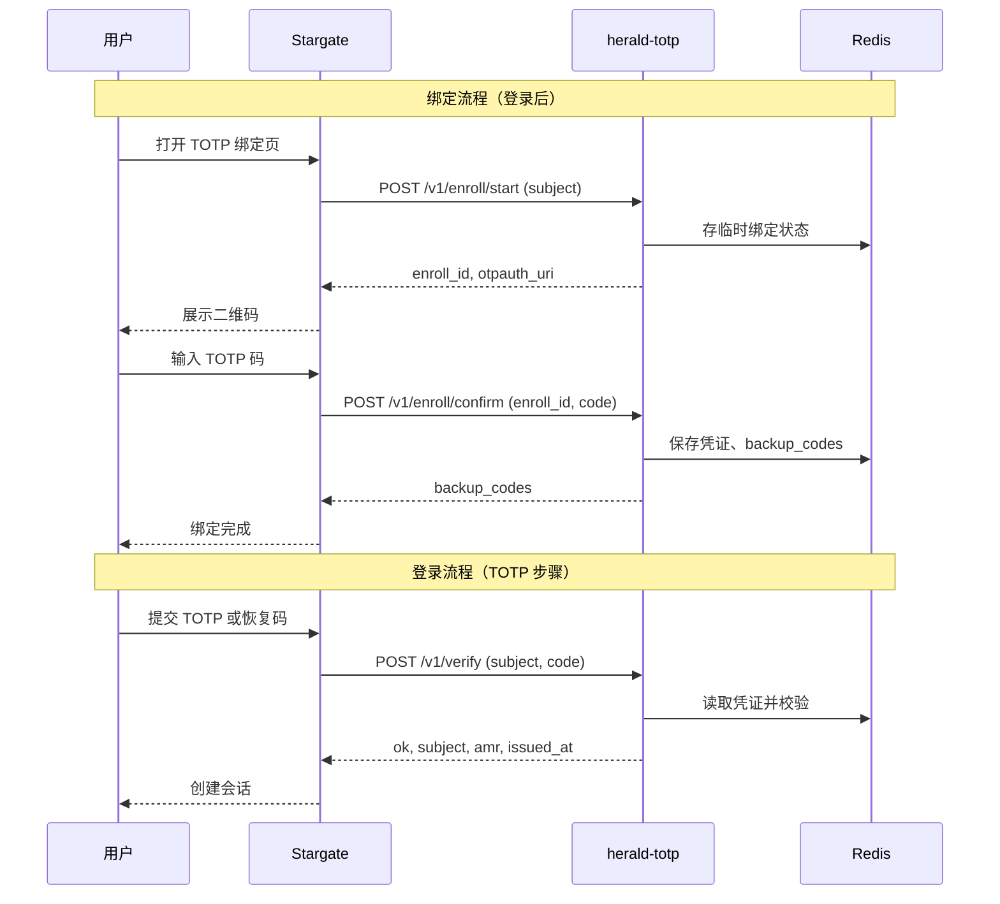

# herald-totp

[](LICENSE)
[](https://golang.org)
[](https://goreportcard.com/report/github.com/soulteary/herald-totp)

## 多语言文档

- [English](README.md) | [中文](README.zhCN.md)

herald-totp 是 Herald/Stargate 栈的 TOTP 双因素认证服务：**绑定（enroll）**、**验证（verify）**、以及可选的**恢复码（backup codes）**。不发送验证码，用户通过验证器应用（如 Google Authenticator）生成 TOTP。Stargate 按用户调用 herald-totp 进行 TOTP 校验，而非使用单一全局密钥。

## 核心特性

- **绑定**：`POST /v1/enroll/start`（返回二维码内容）与 `POST /v1/enroll/confirm`（用一次 TOTP 码确认）。
- **验证**：`POST /v1/verify`（TOTP 或恢复码），返回 `subject`、`amr`、`issued_at`；可选 `challenge_id` 防重放。
- **解绑**：`POST /v1/revoke` 移除该用户的 TOTP 凭证与恢复码。
- **状态**：`GET /v1/status?subject=...` 查询用户是否已开启 TOTP。
- **恢复码**：确认绑定后返回 10 个一次性码，设备丢失时可用来验证。
- **安全**：加密存储密钥（AES-GCM）、限流、时间步防重放、API Key 或 HMAC 鉴权。

## 架构

Stargate 负责登录与 TOTP 绑定编排；herald-totp 在 Redis 中存储每用户 TOTP 密钥（加密）与恢复码，并执行 enroll/verify。



- **Stargate**：ForwardAuth / 登录与 TOTP 绑定编排；调用 herald-totp 完成 enroll 与 verify。
- **herald-totp**：每用户 TOTP 密钥（AES-GCM 存 Redis）、enroll/confirm、verify（TOTP 或恢复码）、revoke、status。
- **Redis**：凭证、绑定临时状态、恢复码、限流状态。

## 快速开始

1. 设置 32 字节加密密钥：`export HERALD_TOTP_ENCRYPTION_KEY="your-32-byte-key!!"`
2. 启动 Redis 与 herald-totp：`go run .`
3. 在 Stargate 配置 `HERALD_TOTP_ENABLED=true`、`HERALD_TOTP_BASE_URL=http://localhost:8084`。

详见 [docs/zhCN/API.md](docs/zhCN/API.md) 与 [docs/zhCN/DEPLOYMENT.md](docs/zhCN/DEPLOYMENT.md)。

## 协议

- **POST /v1/enroll/start**：开始绑定，返回 `enroll_id`、`otpauth_uri`（可选 `secret_base32`）。
- **POST /v1/enroll/confirm**：提交 TOTP 码确认绑定，返回 `backup_codes`。
- **POST /v1/verify**：验证 TOTP 或恢复码，返回 `ok`、`subject`、`amr`、`issued_at`。
- **POST /v1/revoke**：解除该用户的 TOTP 与恢复码。
- **GET /v1/status?subject=...**：查询 TOTP 是否已开启。
- **GET /healthz**：健康检查（含 Redis）。

## 配置

| 变量 | 说明 | 默认值 | 必填 |
|------|------|--------|------|
| `PORT` | 监听端口（可带或不带冒号） | `:8084` | 否 |
| `HERALD_TOTP_ENCRYPTION_KEY` | 32 字节 AES-256 加密密钥 | `` | 是（enroll/verify） |
| `API_KEY` | 若设置，调用方需在 `X-API-Key` 中携带 | `` | 否 |
| `HMAC_SECRET` / `HERALD_TOTP_HMAC_KEYS` | HMAC 鉴权 | `` | 否 |
| `REDIS_ADDR` | Redis 地址 | `localhost:6379` | 是 |
| `EXPOSE_SECRET_IN_ENROLL` | 为 false 时 enroll/start 不返回 `secret_base32` | `true` | 否 |
| `LOG_LEVEL` | 日志级别：trace, debug, info, warn, error | `info` | 否 |

更多见 [docs/zhCN/DEPLOYMENT.md](docs/zhCN/DEPLOYMENT.md)。

## Stargate 侧配置

- `HERALD_TOTP_ENABLED=true`
- `HERALD_TOTP_BASE_URL=http://herald-totp:8084`
- `HERALD_TOTP_API_KEY` 或 `HERALD_TOTP_HMAC_SECRET`（与 herald-totp 一致）

## 构建与运行

### 二进制

```bash
go build -o herald-totp .
./herald-totp
```

### Docker

```bash
docker build -t herald-totp .
docker run -d --name herald-totp -p 8084:8084 \
  -e HERALD_TOTP_ENCRYPTION_KEY="your-32-byte-encryption-key-here!!" \
  -e REDIS_ADDR=redis:6379 \
  herald-totp
```

可选：`-e API_KEY=your_shared_secret`，Stargate 侧设置 `HERALD_TOTP_API_KEY` 为相同值。

## 文档

- **[Documentation Index (English)](docs/enUS/README.md)** – [API](docs/enUS/API.md) | [Deployment](docs/enUS/DEPLOYMENT.md) | [Troubleshooting](docs/enUS/TROUBLESHOOTING.md) | [Security](docs/enUS/SECURITY.md)
- **[文档索引（中文）](docs/zhCN/README.md)** – [API](docs/zhCN/API.md) | [部署](docs/zhCN/DEPLOYMENT.md) | [故障排查](docs/zhCN/TROUBLESHOOTING.md) | [安全](docs/zhCN/SECURITY.md)

## 测试

```bash
go test ./...
```

覆盖率：`go test -cover ./...`，或 `go test -coverprofile=coverage.out ./...` 后 `go tool cover -html=coverage.out`。静态检查：`golangci-lint run`。

## 运维

- **优雅关闭**：收到 `SIGINT` 或 `SIGTERM` 后停止接收新请求，在 10 秒超时内完成关闭。
- **日志**：通过 [logger-kit](https://github.com/soulteary/logger-kit) 输出结构化 JSON 日志。

## 许可证

详见 [LICENSE](LICENSE)。
